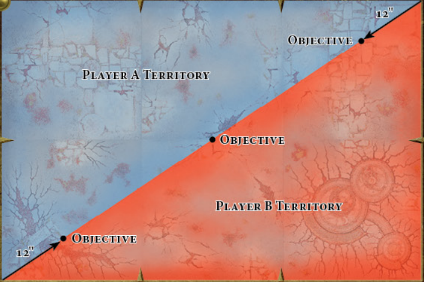

# 1.5K Stormcast Eternals vs Fist of the Everchosen

## The Lists

### Stormcast Eternals

- Allegiance: Stormcast Eternals
    - Stormhost: Hammers of Sigmar
    - Mortal Realm: Aqshy
- Leaders (3)
    - Aventis Firestrike Magister of Hammerhal (360)
        - General
        - Spell: Azyrite Halo
        - Mount Trait: Lithe-limbed
    - Gavriel Sureheart (100)
    - Lord-Relictor (100)
        - Artefact: God-forged Blade 
        - Prayer: Translocation
- Battleline (2)
    - 10 x Sequitors (240)
        - Tempest Blades and Soulshields
        - 5x Stormsmite Greatmaces
    - 5 x Liberators (100)
        - Warhammer & Shield
        - 1x Grandhammers
- Units (3)
    - 10 x Evocators (400)
        - 10x Grandstaves
        - Lore of Invigoration: Celestial Blades
    - 3 x Prosecutors with Stormcall Javelins (100)
        - 1x Stormsurge Tridents
    - 3 x Prosecutors with Stormcall Javelins (100)
        - 1x Stormsurge Tridents

**Total**: 1500

### Fist of the Everchosen

- Allegiance: Fist of the Everchosen
    - Mortal Realm: Shyish

- Leaders (4)
    - Bloodsecrator (140)
        - Artefact: The Ragged Cloak
    - Slaughterpriest (100)
    - Chaos Sorcerer Lord (160)
        - General
        - Mount: Steed
        - Runesword
        - Trait: Cunning Deceiver
        - Mark of Chaos: Tzeentch
    - Magister (140)
- Battleline (4)
    - 10 x Blood Warriors (200)
        - Goreaxe & Gorefist
        - 1x Goreglaives
    - 40 x Chaos Marauders (200)
        - Axes & Shields
        - Mark of Chaos: Khorne
    - 30 x Tzaangors (480)
        - 15x Pair of Savage Blade
        - 12x Savage Greatblade
        - 3x Savage Blade & Arcanite Shield
    - 10 x Kairic Acolytes (80)
        - 1x Pair of Cursed Blades
        - 6x Cursed Blade & Arcanite Shield
        - 3x Cursed Glaives

**Total**: 1500

## The Setup

- Terrain: 1 feature per each of the 6 zones.
- Realm: No Realm rules were used.
- Battleplan: The rolled Battleplan was Escalation.

## Deployment

Stormcast won the roll and deployed first (blue area).

Stormcast decided to deploy his *Liberators* and *Sequitors* at 18" from the center objective, with the *Relictor* behind them.
One unit of *Prosecutors* was close to these units but towards the right flank and the other one was at 9" from the left objective.
*Aventis* was set up half-way between the left unit of *Prosecutors* and the main force.
*Gavriel* and the *Evocators* (the *Gavriel-Bomb*) were left in **Deep Strike**.

On the Fist of the Everchosen (red) side, the *Tzaangors* were set up at 9" from the center objective, with the *Kairic Acolytes* right behind them and the *Magister* + *Chaos Lord* as close to them as their 18" minimum alllowed.
The *Chaos Marauders* were set up as close to the left objective as possible, with the *Bloodsecrator* and *Slaughterpriest* as close to them as possible.
Finally, the *Blood Warriors* were set as a screen behind the army and to the right flank to avoid the *Gavriel-Bomb* landing and killing all the heroes or the *Kairic Acolytes*.
No 9" spaces were left behind the army,

## Round 1

Stormcast decided to give Fist of the Everchosen the first turn.

### Turn 1.1: Fist of the Everchosen

#### Hero Phase

*Tzaangors* were given **Daemonic Power** by the *Chaos Lord*, the *Magister* gave **Mystic Shield** to the *Chaos Marauders* and the *Chaos Lord* gave his **Oracular Visions** to the *Blood Warriors*

#### Movement Phase

The entire army advanced running.
*Tzaangors* took the central objective, *Chaos marauders* took the left one, with the *Bloodsecrator* remaining at 6" from them and the *Slaughterpriest* close behind.
*Kairic Acolytes* kept up behind the *Tzaangors* and the *Magister* managed to catch up to them with an epic run roll.
The *Chaos Lord* slightly repositioned a bit to the left and the *Blood Warriors* spread out to the right again blocking any **Deep Strike** shenaningans.

#### Shooting Phase

The *Kairic Acolytes* weren't in range of anything.

### Turn 1.2: Stormcast Eternals

#### Hero Phase

*Aventis* failed casting an **Arcane Bolt** on the *Chaos Marauders* and successfully cast the **Azyrite Halo** on the *Sequitors*.
The *Lord-Relictor* succesfully prayed a **Translocation** for the *Sequitors* and set them up in the right flank at 9" from the *Blood Warriors*.

#### Movement Phase

Left-flank *Prosecutors* advanced to 3" from the *Chaos Marauders*, which were also approached by *Aventis*.
The *Liberators* advanced a little bit while the *Relictor* ran towards the left flank.
The right-flank *Prosecutors* moved to be at 18" from the *Tzaangors*.
Finally, *Gavriel* and the *Evocators* landed at 9" from the *Chaos Marauders* in the left flank.

#### Shooting Phase

The left-flank *Prosecutors* took down a *Chaos Marauder*.

#### Charge Phase

A **Command Point** was spent to activate *Gavriel*'s +3 to Charge.

The following charges **succeeded**:
- Left-flank *Prosecutors* on the *Chaos Marauders*
- *Aventis* on the *Chaos Marauders*

The following charges **failed**:
- *Evocators* on *Chaos Marauders*
- *Gavriel* on *Chaos Marauders*
- Right-flank *Prosecutors* on *Tzaangors*
- *Sequitors* on *Blood Wariors*

#### Combat Phase

*Aventis* broke 3 **Spirit Flasks** and killed 7 *Chaos Marauders*.
In the following combat, about 5 other *Chaos Marauders* died to *Aventis* and the *Prosecutors*.
However, *Aventis*' pile-in put him within 3" of the *Bloodsecrator*, who managed to land a wound on him.
The *Chaos Marauders* also wounded one *Prosecutor*.

#### Battleshock phase

A **Command Point** was spent by the *Bloodsecrator* to avoid rolling battleshock for the *Chaos Marauders*.

## Round 2

The roll was won by *Fist of the Everchosen*, who opted to go first.

### Turn 2.1: Fist of the Everchosen

#### Hero Phase

The *Chaos Lord* failed casting **Daemonic Power** and gave his **Oracular Visions** to the *Blood Warriors*.
The *Magister* failed casting **Bolt of Change**.
The *Slaughterpriest* successfully prayed a **Blood Boil** on *Aventis*, dealing 3 Mortal Wounds.
The *Bloodsecrator* planted his standard.

#### Movement Phase

The *Tzaangors* approached the right-flank *Prosecutors* while the *Kairic Acolytes* took over control of the central objective.
The *Magister* made sure to stick close to the *Tzaangors*, while the *Chaos Lord* move to the left flank to support.
The *Blood Warriors* approached the *Sequitors*.
The *Slaughterpriest* move to be at just over 3" from *Aventis*.

#### Shooting Phase

The *Kairic Acolytes* dealt 1 wound to the right-flank *Prosecutors*.

#### Charge Phase

*Tzaangors* successfully charged the *Prosecutors* on the right flank, while the *Blood Warriors* charged the *Sequitors*.
Finally, the *Slaughterpriest* charged *Aventis* while the *Chaos Lord* failed his long-range charge.

#### Combat Phase

About 6 *Chaos Marauders* died while killing a *Prosecutor* and wounding another.
The *Tzaangors* obliterated the right-flank *Prosecutors*, and the *Slaughterpriest* survived all of *Aventis*' attacks taking 3 wounds.
The *Bloodsecrator* and *Slaughterpriest* together were able to take down *Aventis*, with the *Slaughterpriest* dealing the killing blow.
On the right flank, 4 *Blood Warriors* fell to the *Sequitors*, taking one down.

#### Battleshock Phase

2 *Blood Warriors* fled.
2 Victory points were gained by *Fist of the Everchosen* for the central and left-flank objectives.

### Turn 2.2: Stormcast Eternals

#### Hero Phase

The *Lord-Relictor* failed his prayer and the *Evocators* failed to cast **Empower**.

#### Movement Phase

The *Evocators* and *Gavriel* approached the *Chaos Marauders* on the left flank, while the *Relictor* took refuge behind nearby terrain.
The *Liberators* approached the *Tzaangors*.

#### Shooting Phase

No wounds were dealt.

#### Charge Phase

*Evocators* successfully charged the *Chaos Marauders*, and the *Liberators* charged the *Tzaangors*.

#### Combat Phase

*Evocators* melted through the *Chaos Marauders*, leaving only 2 alive.
*Tzaangors* killed all the *Liberators*.
One more *Blood Warrior* fell to the *Sequitors*, who suffered another casualty.

#### Battleshock phase

1 Victory Point went to the *Stormcast Eternals* for controlling the left-flank objective.

## Round 3

The initiative roll was won by *Fist of the Everchosen*.

### Turn 3.1: Fist of the Everchosen

*Tzaangors* charged the *Sequitors* and killed them all.
The 2 *Chaos Marauders*, the *Bloodsecrator* and the *Slaughterpriest* (who killed an *Evocator* with his **Blood Boil**), all ran towards the center.

1 more Victory Point (for a total of 3) went to *Fist of the Everchosen*

### Turn 3.2: Stormcast Eternals

With the help of the *Lord-Relictor*'s **Translocation** and *Gavriel* running to be in range, the *Evocators* charged the *Kairic Acolytes* and killed them all.

2 Victory Points (for a total of 3) went to *Stormcast Eternals*

## Round 4

The initiative roll was won by *Fist of the Everchosen*.
*Stormcast Eternals* conceded the game at this point.
