# Fyreslayers

- [The Units](#the-units)
- [The Battallions](#the-battallions)
- [The Runes](#the-runes)
- [Strategy](#strategy)
- [Tactics](#tactics)
- [Buying Order](#buying-order)

## The Units

We'll talk about all of the units, their options and considerations for them when being taken on any list.

However, some common things to take into account:

1. All heroes have 4+ Save
2. All other units have 5+ Save
3. Magmadroths move 12" reduced by wounds, duardin move 4" instead.
4. Magmadroths have 12 wounds, heroes have 5 or 6, units have 1 wound.
5. Heroes carry 1/3+/3+/-/1 8" throwing axes, other units have a 4+ hit instead.
6. Karls (Unit leaders) always do +1 damage in melee

### Auric Runefather on Magmadroth (260)

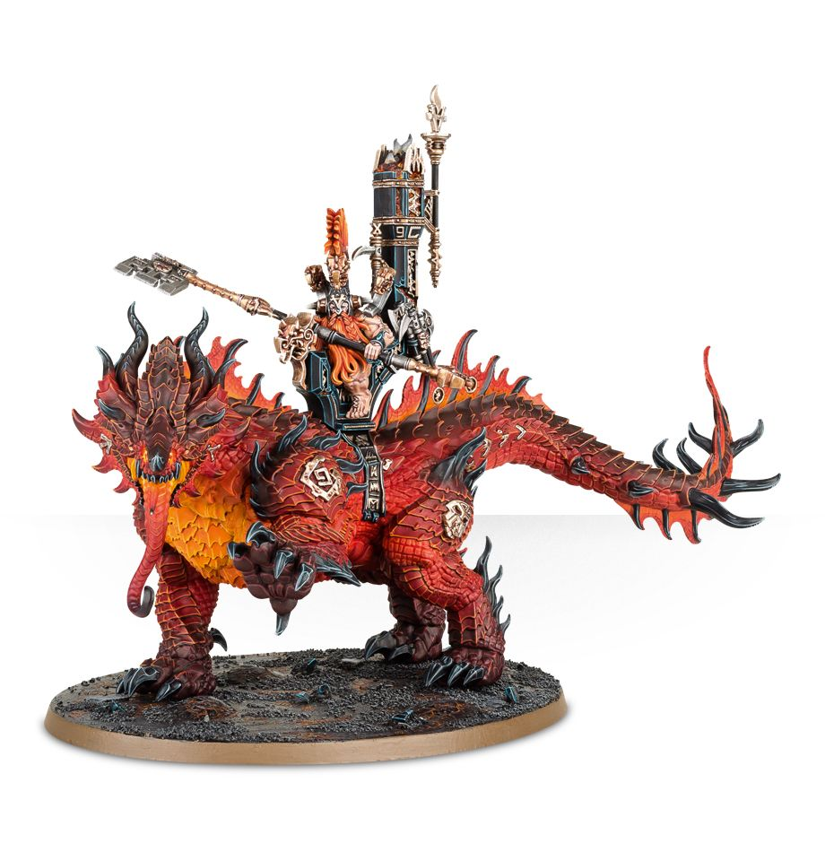

The big daddy of all the Fyreslayers, the Runefather on Magmadroth (a.k.a. Magmadad) is a formidable fighter that will quickly become a high priority target for your opponent. If you keep him from dying, he can turn the tide allowing your other warriors to push through.

#### Weapon options

The Magmadad doesn't have any weapon options, but his sole profile is quite nice, wielding a 3/4+/3+/-1/3 Latchkey Grandaxe with the Weapon-breaker ability which can damage enemy HERO and MONSTER weapons.

However, the big source of damage is really the Magmadroth with its 6/4+/3+/-1/2 Claws and horns and his other abilities.

#### Abilities

The Magmadad's abilities are mostly great vs hordes and for supportish fights.

Magmadroth abilities:
- Roaring Fyrestorm: D3 or D6 mortal wounds shooting attack. Can be used even if you ran.
- Lashing Tail: D3 mortal wounds melee attack at end of combat phase.
- Volcanic Blood: D3 mortal wounds melee attack at end of any phase in which it suffered damaged.

Runefather abilities:
- Steadfast Advance (Command): Fyreslayers wthin 18" (24" if general) can re-roll BS and Saves of 1.
- Stare Down: -D3 Bravery to one unit at melee range
- Weapon-breaker: 50% chance to break a HERO or MONSTER's weapon on a save of 6+.

#### Notes

This guy deals a nice amount of damage and has great support abilities, but he is kinda squishy if focused.

Ideally, you want him to support a charge made by one of your frontline units (Vulkites or Hearthguard Berzerkers) rather than have him run in alone like a Frostlord on Stonehorn.

### Auric Runesmiter on Magmadroth (200)

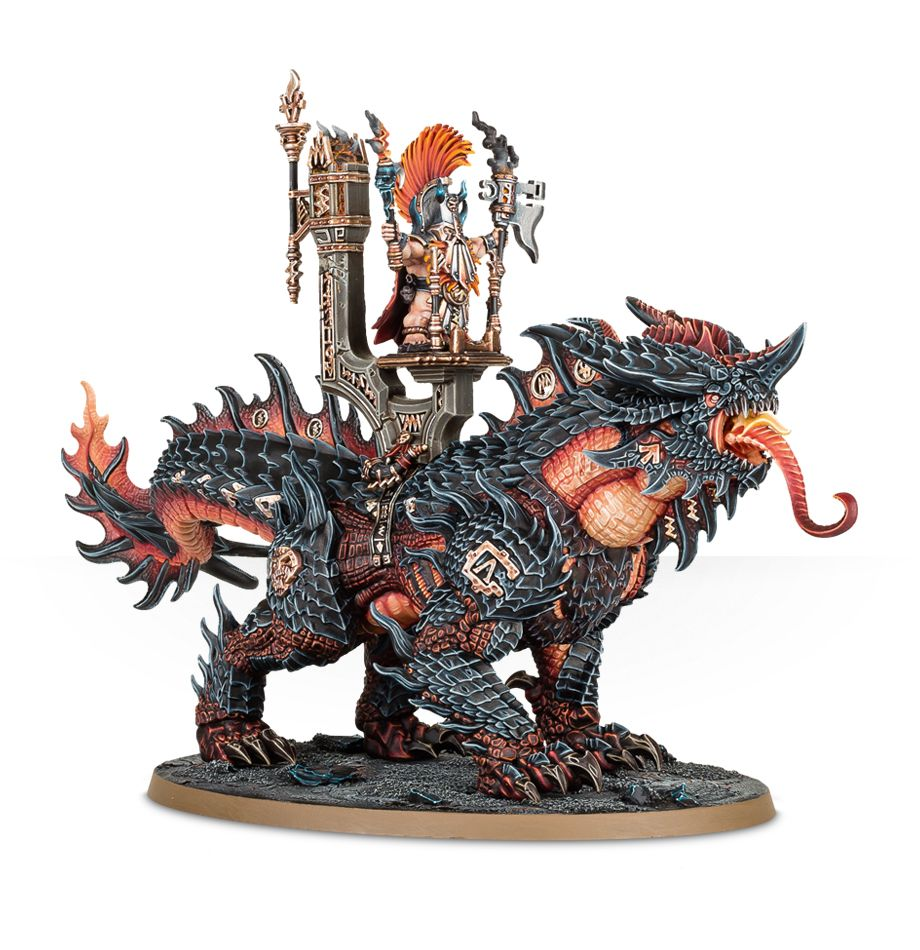

A pure support hero set up on top of a huge monster, what's not to love?

#### Weapon options

None. It looks like you can choose between Forge Key and Runic Iron, but the Key is just better: you're a support, you won't ever charge in and hit things unless forced to...

#### Abilities

Same Magmadroth abilities as above.

Runesmiter abilities:
- Runic Empowerment: Give wounds reroll to a Fyreslayers unit within 20". Wat.
- Grand ritual of awakening: Once per battle, instead do it to *all* Fyreslaters within 10". WAT.

#### Notes

If you didn't lose on the deep-strike from having him on foot this would be on every list. It's pretty bonkers, but Firedorfs have way too many competing crazy stuff.

### Auric Runeson on Magmadroth (240)

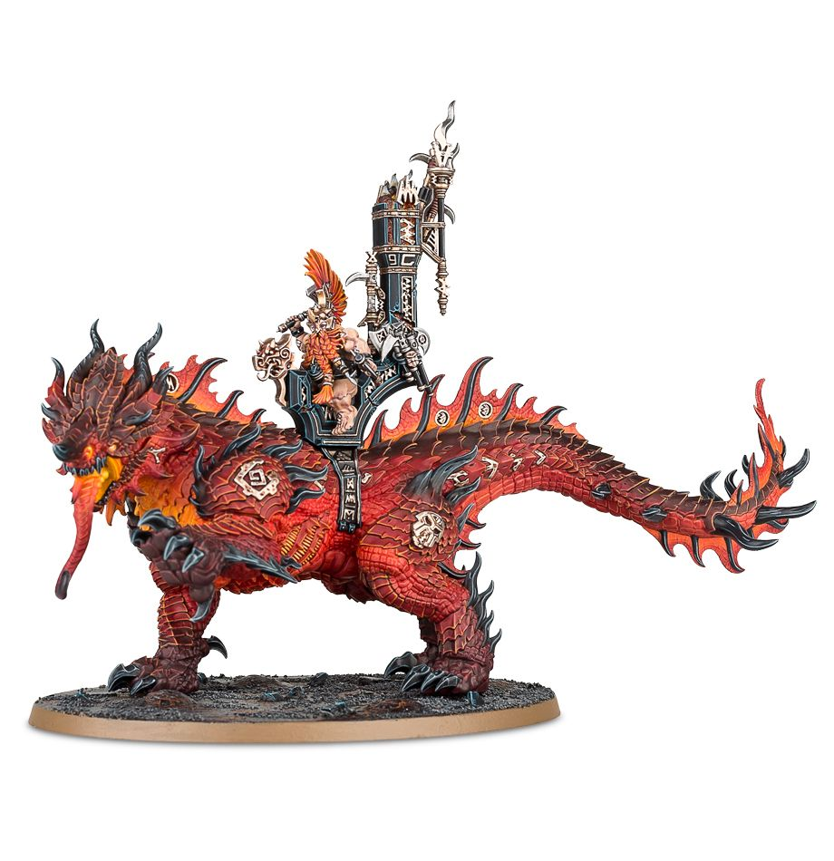

You are allowed to charge this one in.

#### Weapon options

You can choose between an Ancestral War-Axe for maximum Berzerkerness (3/3+/4+/-/D3) or a Wyrmslayer Javelin to kill off opposing monsters (1/3+/3+/-1/D3 at 12", 1/4+/3+/-1/1 at 3").

The Javelin when shot against a monster does +2 damage.

#### Abilities

Aside from the usual magmadroth ones:
- Furious Onslaught (Command): Fyreslayers wholly within 12" can reroll charges.
- Explosive Rage: Pick a unit it can see. It gets -1 Bravery. Reroll Runeson's hits of 1 against it.
- Wyrmslayer Javelins: The aformentioned +2 damage in shooting phase.

#### Notes

This is mostly a monster killer with the javelin, but can rival the Magmadad damage up front as well.

### Auric Runefather (100)

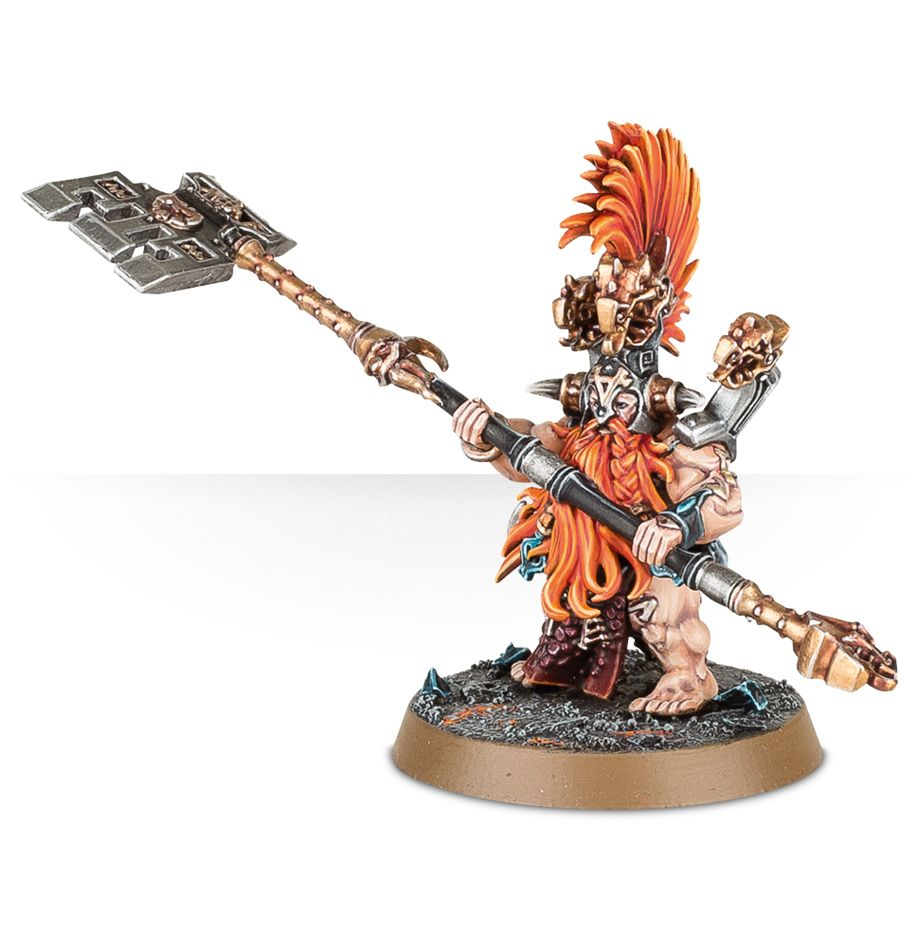

Pretty much the same as the Magmadroth version (minus the magmadroth stuff, obviously), but with a different command ability:
- Lodge Leader (Command): Nearby Fyreslayers can pile in 5". Also, on a 4+ you can redirect wounds or mortal wounds to another Fyreslayer unit within 3".

So he is almost as resilient as the Magmadroth if you spend the command point, but he's not a very good support, so it's a little suspect to take him unless you really need battleline Hearthguard Berzerkers.

### Auric Runesmiter (120)

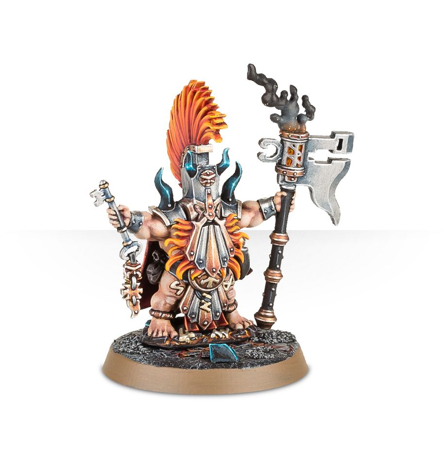

Same as Magmadroth version minus the big M, however he loses his Grand Ritual and instead gains the power to deep strike himself with another Fyreslayer Unit.

GGWP.

### Auric Runeson (80)

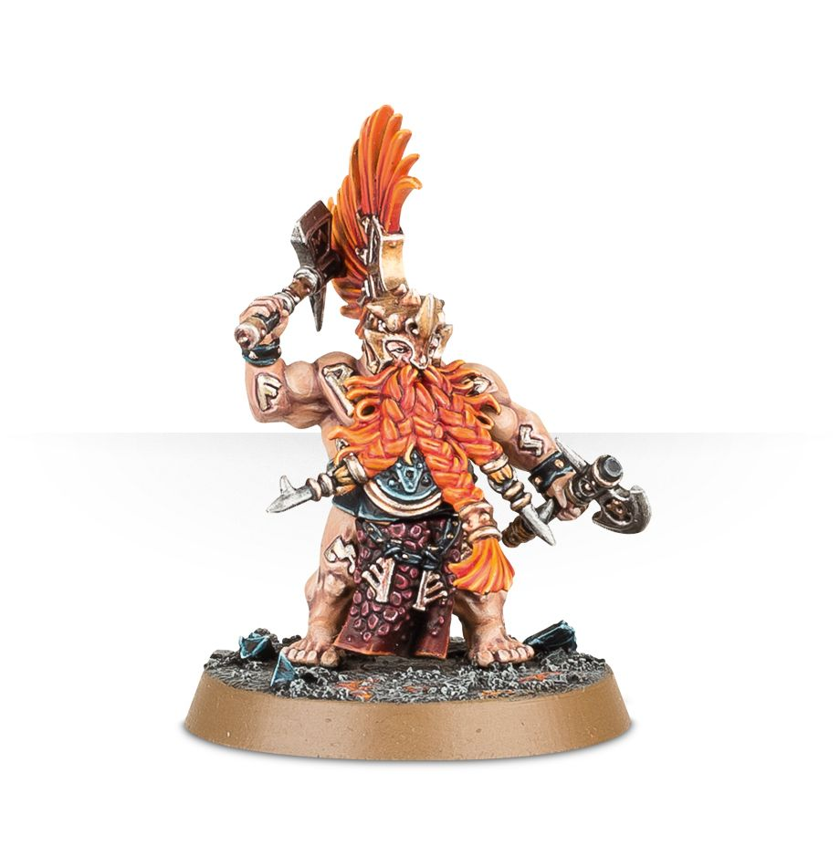

On foot you'd better be taking the Javelin or he'll just die without doing anything.

His command ability becomes:
- Dauntless Assault: Reroll wound rolls of 1 for Fyreslayers wholly within 18".

### Grimwrath Berzerker (80)

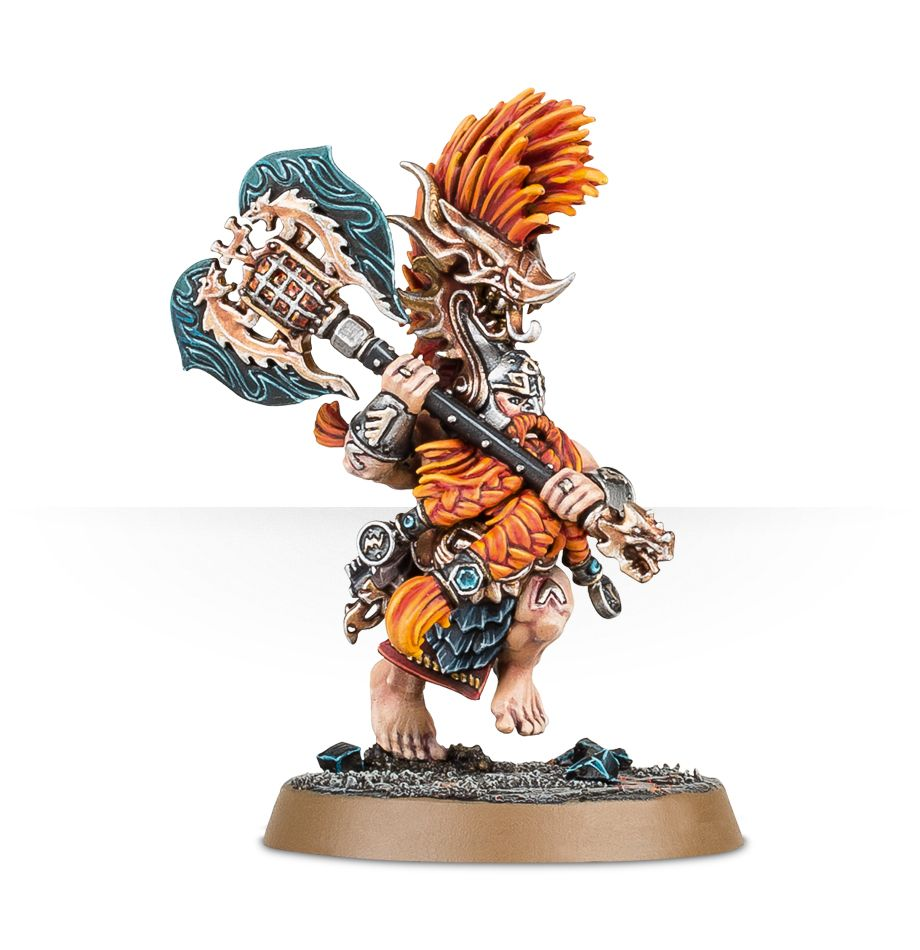

With a 4/3+/3+/-1/D3 Greataxe and the ability to hit twice... this is a berzerker.

#### Abilities

- Unstoppable Berzerker: 6+ Invulnerable Save. +1 to the roll for each enemy unit within 3".
- Dead, but not defeated: when slain in combat phase, on a 2+ he stays around until the end of the phase.
- Battle fury: Once per turn, after attacking, roll a dice. If result is less than wounds he has dealt, attack again immediately.

#### Notes

Now this is a striker. Charge him directly into battle at something you want to hurt. And the more surrounded he is, the more invincible he is. If you manage to ever get him within 3" of 5 different enemy units he becomes immortal.

### Auric Runemaster (80)

Only take if you need Lords of the Lodge for Heartguard Berzerker cheesing. Next!

### Battlesmith (120)

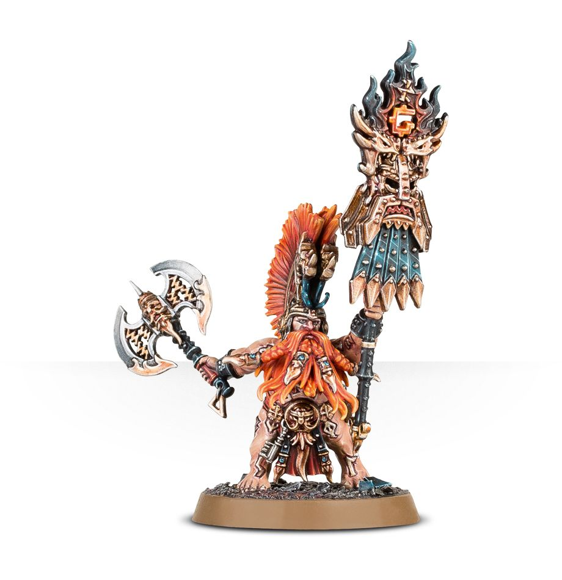

#### Abilities

Basically, he is two walking abilities:
- Icon of Grimnir: Fyreslayer units within 8" in the hero phase get to reroll failed saves until your next hero phase.
- None Shall Defile the Icon: When slain, a Fyreslayer unit within 5" can swear to protect the icon. They get rerolls to hits *and* wounds for the rest of the game, but they cannot move except to pile-in.

#### Notes

This guy makes your army almost immortal. His only problem is no invulnerable save on himself, but Ignax's Scales takes care of that.

### Vulkite Berzerkers (120 for 10, 360 for 30)

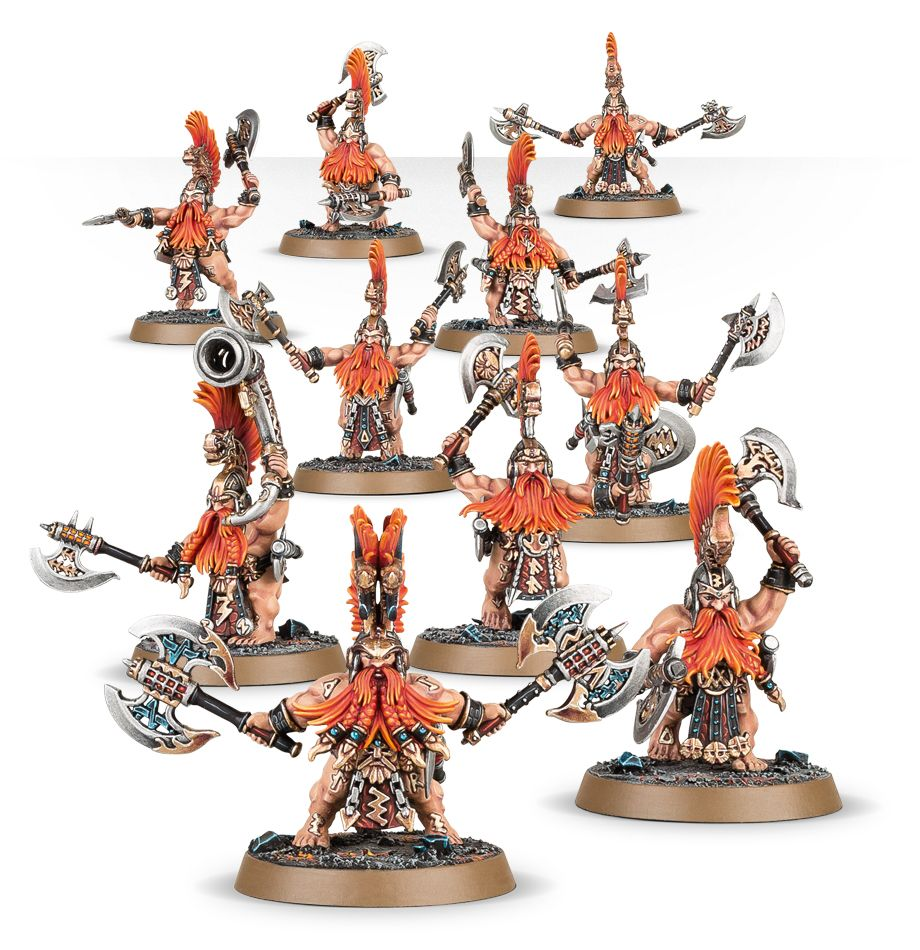

Both the hammer *and* the anvil.

#### Weapon options

- Fyresteel Handaxe: 2/4+/3+/-/1
- Fyresteel War-pick: 2/4+/4+/-1/1
- Bladed Slingshields: +1 Save in combat phase if you didn't charge that turn. When completing a charge, pick a unit and throw a dice for every Vulkite Berzerker within 8" of that unit. Each 6 is a mortal wound dealt.
- Pair of Handaxes: Reroll all failed hits.

#### Abilities

- Berserk Fury: Ignore wounds and mortal wounds on a 6. +1 to roll if 10+ models *at start of phase*. +2 if 20+.

#### Notes

Double handaxes make them deal a million damage. Slingshields packa punch and are great for holding. War-picks can penetrate through most armored units.

Always take in units of 30 if possible.

### Auric Hearthguard (100 for 5, 480 for 30)

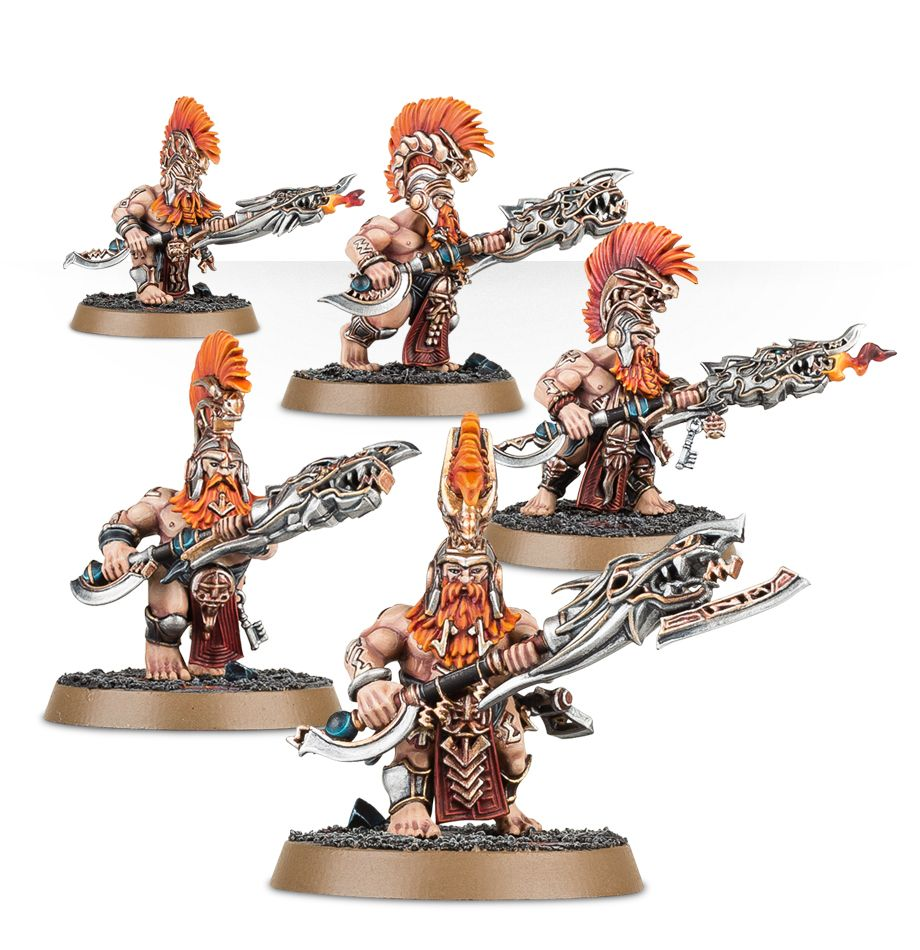

Ranged damage. Just what was missing.

#### Weapons

- Molten Rockbolts (15"): 2/4+/3+/-1/1
- Magmapike: 1/4+/3+/-/1

#### Abilities

- Molten Rockbolts: if they deal any damage to a monster, at the end of the phase roll a dice. On 5+ its Move is halved and it takes -1 to hit.
- Sworn Protectors: +1 to hit if target is within 5" of a Fyreslayer Hero

#### Notes

Pretty good ranged option, especially paired with a Runesmiter to deep strike in.

### Hearthguard Berzerkers (100 for 5, 480 for 30)

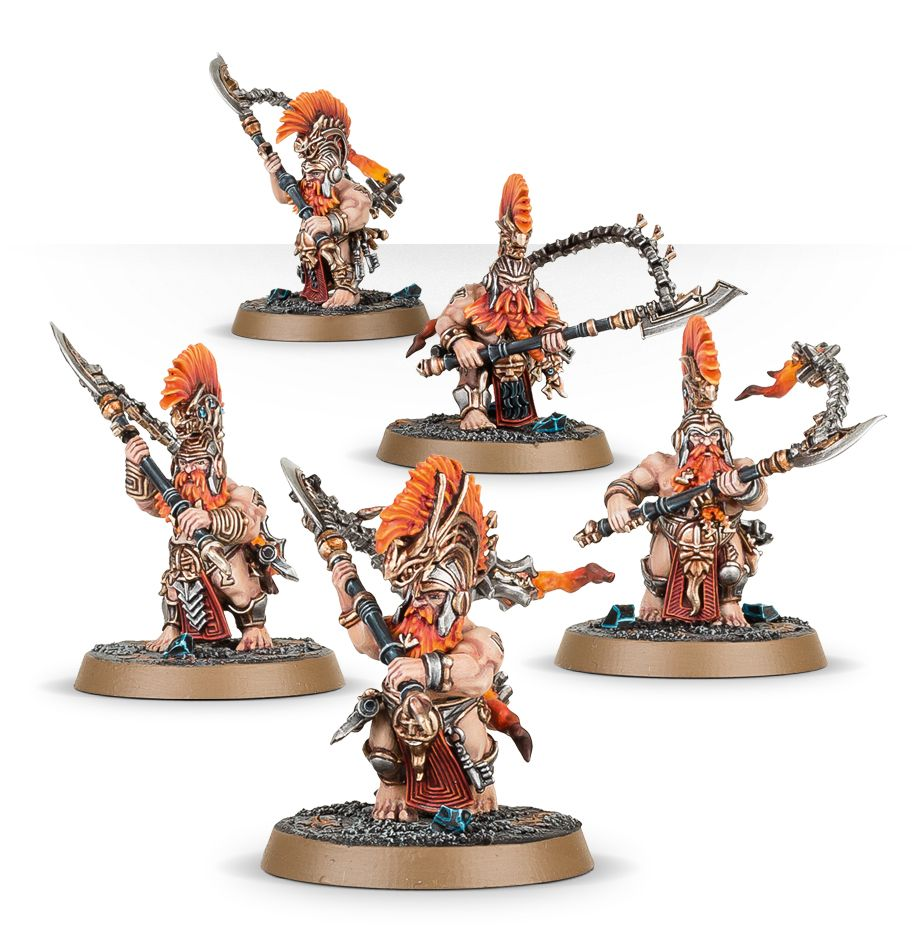

The true elite melee unit of the faction, with a both simpler and harder to mantain defensive ability and better weapons than their Vulkite bros.

#### Weapon options

- Berzerker Broadaxe: 1/3+/3+/-1/2
- Flamestrike Poleaxe: 1/3+/4+/-/1, but on a hit does a mortal wound on a 3+.

#### Abilities

- Duty Unto Death: Ignore wounds or mortal wounds on 6+. +2 to the roll if within 10" of Fyreslayer HERO.

#### Notes

This guys are pretty good and absolutely brutal with the Lords of the Lodge ability that allows them to swing twice. Generally more expensive to take than the Vulkites, though, so you'll at most field a unit of 5-10 of these unless you take the 30 model discount (which is a pretty sweet deal).

Of important note is the fact that the Flamestrike Poleaxe only slightly overtakes the Broadaxe (by 0.01 average wounds) when the target has a Save of 4+. This means that it's mostly effective vs units with 3+ Save (like Stormcast Eternals) or units that reduce damage (Beastclaw Raiders).

Even then, the Rune of Awakened Steel can compensate in those cases for the Broadaxes, so it's generally the better option, probably (unless you know you will only face Stormcast and Beastclaw, really).

## The Battallions

### Lords of the Lodge (110)

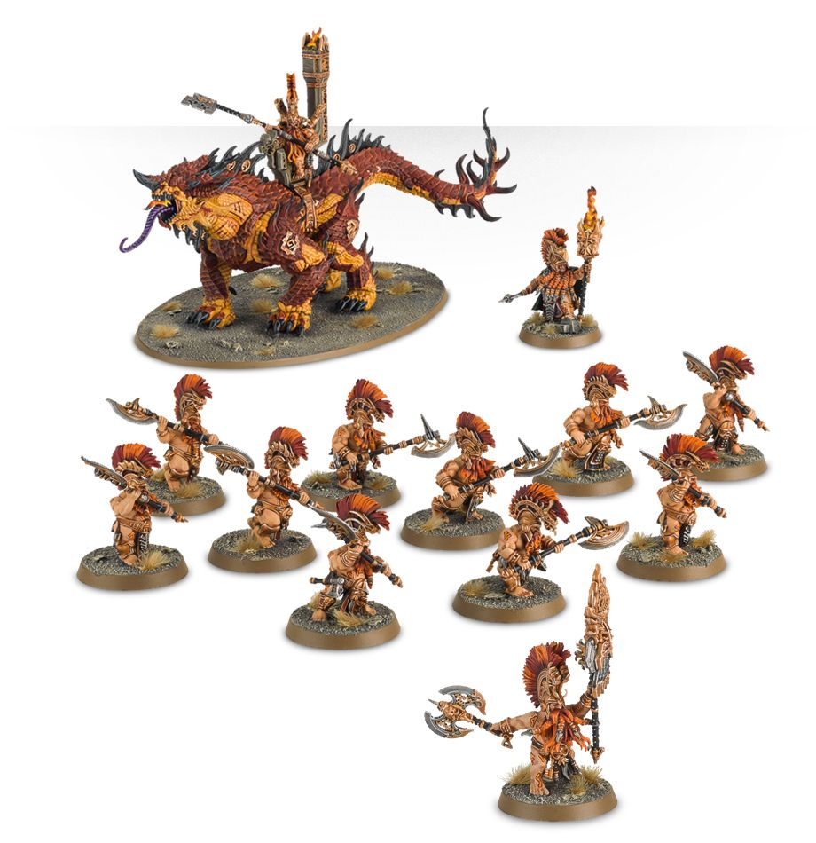

- 1 Auric Runefather or Auric Runefather on Magmadroth
- 1 Auric Runemaster
- 1 Battlesmith
- 1 unit of Hearthguard Berzerkers

Abilities:
- Hot-blooded Fury: On the first turn, you may roll a dice. On a 2+ you go first, without having to roll off.
- Oathbound Guardians: The unit of Hearthguard Berzerkers can be selected to pile in and attack twice in the combat phase, but only if there's a HERO from the battallion within 6" of them

#### Notes

The main reason to take Hearthguard Berzerkers and a Runemaster, the Oathbound Guardians ability is crazy good, especially if you have a Runefather + Battlesmith combo next to them, making it very hard to kill them or the heroes.

### Warrior Kinband (120)

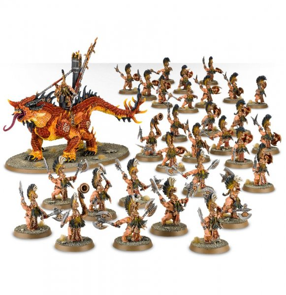

- 1 Auric Runeson or Auric Runeson on Magmadroth
- 3 units of Vulkite Berzerkers

Abilities:
- Legacy of the Lodge: Vulkite Berzerker models within 10" of their Kinband's Runeson can throw their axes twice.
- Berserk Kindred: Vulkite Berzerkers move an aditional D3" when they pile in if they are within 5" of another unit of Vulkites from the same Kinband.

#### Notes

This battallion can surprise with the amount of range that happens, especially if you use the Rune of Farsight. Also, it's an effective cheap way to add points to your army on a budget.

However, throwing axes is not the most impressive attack ever, so don't expect this to win you games on its own.

### Forge Brethren (140)

- 1 Auric Runesmiter or Auric Runesmiter on Magmadroth
- 3 units of Auric Hearthguard

Abilities:
- Master-forged Blades: on a 6+ wound roll in the combat phase, subtract 1 from the save result.
- Bulwark of Molten Stone: In the hero phase, pick an Auric Hearthguard unit within 10" of the Runesmiter. Then pick a unit within 15" of that Auric Hearthguard. Add 1 to that unit's Save rolls until it charges or your next hero phase.

#### Notes

Pretty good, crazy expensive. Normally a Battlesmith is more effective, but this stacks with it.
Make sure to protect the Runesmiter!

### Vostarg Lodge (100)

- 1 Lords of the Lodge (with aditional unit of Hearthguard Berzerkers)
- 1 Warrior Kinband
- Any other Fyreslayer units

Abilities:
- Proud Lineage: The Rune of Fiery Determination is always activated with an enhanced effect.
- Fearsome Reputation: Subtract 1 Bravery from any enemy units within 3" of units from the Battallion

#### Notes

This comes with an awesome benefit: having *two* units of Hearthguard Berzerkers to benefit from Lords of the Lodge.

However, it costs 100 points on top of forcing you to also pick a kinband which means you also need to bring 3 units of vulkites (which will probably be 10-man then), which means it's probably a prohibitive cost in terms of fielding a very useful army.

This might be awesome in 2.5k, though.

## The Runes

At the start of each of your hero phases, you can activate a rune. A rune can only be activated once per game. Roll a dice and on a 6 you get its enhanced effect.

- Rune of Fury: Reroll 1s to hit on the combat phase. *Enhanced*: Add 1 to Attacks of melee weapons.
- Rune of Searing Heat: Wound rolls of 6+ are resolved with +1 Damage. *Enhanced*: Deal 1 mortal wound to enemy units within 3" of *any* Fyreslayer units.
- Rune of Awakened Steel: Melee weapons get -1 Rend. *Enhanced*: Additional -1 Rend
- Rune of Fiery Determination: Ignore Battleshock. *Enhanced*: Models slain in combat stay until the end of the  phase.
- Rune of Relentless Zeal: +4 Move. *Enhanced*: +4 Charge.
- Rune of Farsight: +8" range to Throwing Axes. *Enhanced*: Reroll 1s to hit for Throwing Axes.

### Notes

Turn 1 you will almost always use *Farsight* (to hit with throwing axes), *Relentless Zeal* (to set up a charge) or *Fiery Determination* (if you need to hold your ground).

Remember that *Farsight* plus a **Runesmiter** Deepstrike probably guarantees your entire unit throwing their axes at something, but also remember that the Throwing Axes aren't particularly good.

When you need to hit something harder, the best option will nearly always bee *Awakened Steel* for the Rend. In the event that you are swinging at enemies with no Save at all or have already used *Awakened Steel*, use *Searing Heat* or *Fury*, in that order.

## Strategy

### Army Core

The possible cores are:
- Vulkite Spam (Including Warrior Kinband)
- Lords of the Lodge (with a 30-man Hearthguard Berzerkers unit)
- Forge Brethren
- Vostarg Lodge

I would consider the first two to be much superior as core components, and in fact they can be combined (there is enough space in 2k for Lords of the Lodge with 30 Hearthguard + two full units of Vulkites).

### Heroes

TBD

### Metagame

TBD

## Tactics

TBD

### Matchups

TBD

### Battleplan quirks

TBD

### Common combinations

TBD

## Buying Order

Current plan is:
- ~~The Chosen Axes~~
- Fyreslayers Army
- Vulkite Berzerkers x 2
- Hearthguard Berzerkers x 2
- Battlesmith
- Auric Runemaster
- Vulkite Berzerkers x 2
- Hearthguard Berzerkers x 2
- Grimwrath Berzerker
- Auric Hearthguard
- Vulkite Berzerkers
- Hearthguard Berzerkers x 2
